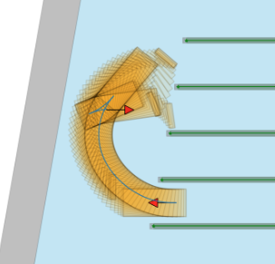

# Headland_trajectory_planning

This repo includes headland space modeling and trajectory planning for autonomous agricultural vehicles in the orchard. The whole environment is modeled with geometric shape. The headland planning algorithm is very similar to the valet parking problem in the clusttered environment. We leverages the [OBCA trajector](https://github.com/XiaojingGeorgeZhang/OBCA)  planner applied in [Apollo-Baidu](https://github.com/ApolloAuto/apollo). 

The techinique details of the repo is introduced in our [JFR journal paper](https://www.researchgate.net/publication/372858867_Optimization-Based_Motion_Planning_for_Autonomous_Agricultural_Vehicles_Turning_in_Constrained_Headlands) under final reviewing.

## Updates

* **Dec 8, 2023** - Initial release.

## About

If our repo helps your projects either from industry or academia, please cite our paper and star our repo. Thank you! You are very welcome to reach us for a discussion in the agricultural robotics!!

__Author__: [Chen Peng](https://hic.zju.edu.cn/2023/0904/c72951a2797324/page.htm), [Peng Wei](https://alexwei92.github.io/) and [Zhenghao Fei](https://hic.zju.edu.cn/2023/0904/c72951a2797279/page.htm).

__Paper__: [Optimization based Motion Planning for AAV in Constrained Headland](https://www.researchgate.net/publication/372858867_Optimization-Based_Motion_Planning_for_Autonomous_Agricultural_Vehicles_Turning_in_Constrained_Headlands), Chen Peng*, Peng Wei*, Zhenghao Fei, Yuankai Zhu and Stavros G. Vougioukas

## How to start

- Install dependency
```bash
pip install -r requirments.txt
```
- Try the code step by step from [Jupyter Notebook](https://github.com/AgRoboticsResearch/headland_trajectory_planning/test)

## Repo Features

- Modeling of the headland space in the geometric shape
<p align="center">
    
</p>

- Implementation of Classic planner of headland turning
<p align="center">
    
    
    
</p>

- Headland turning with implements(Prunner)
<p align="center">
   
</p>

## Videos on real robot
- Tested on real robot in the vineyard of UC, Davis on [youtube](https://www.youtube.com/watch?v=sf0uDFwpSfo).
<a href="https://www.youtube.com/watch?v=QQS0AM3iOmc" target="blank">
    <p align="center">
        
    </p>
</a>
