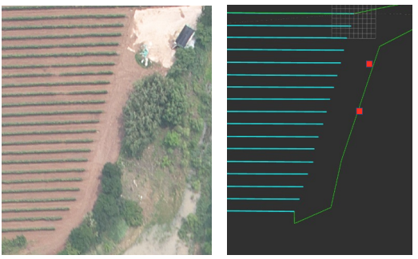
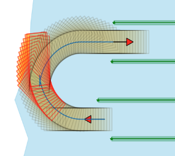
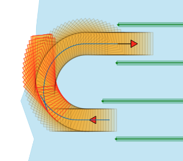
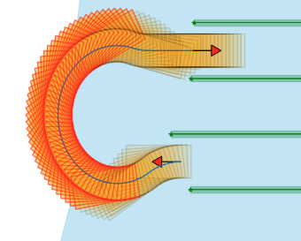
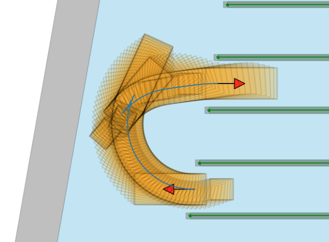
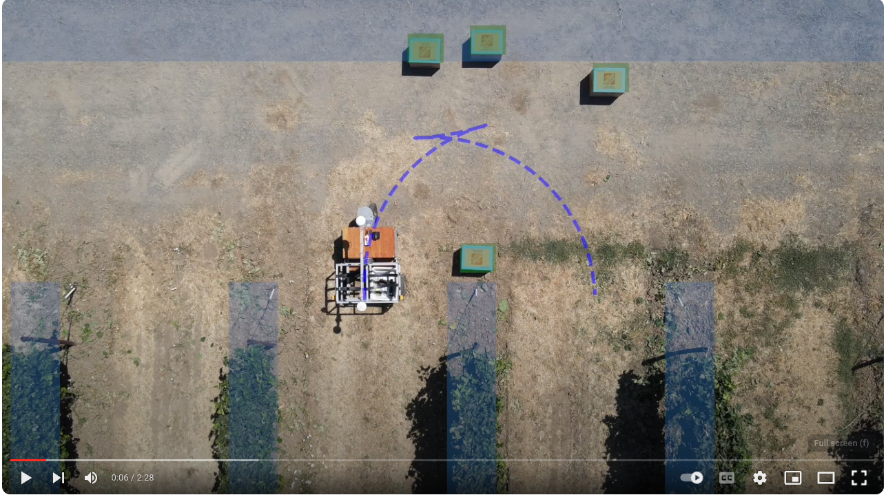

# Headland_trajectory_planning

[](https://onlinelibrary.wiley.com/doi/full/10.1002/rob.22374)
[](https://arxiv.org/abs/2308.01117)


This repo introduces a method of headland space modeling and trajectory planning for autonomous agricultural vehicles (AAV) operating in the orchard. The environment is modeled with geometric shapes, and the headland turning is solved similarly to the valet parking problem in a cluttered environment. We leverage the [OBCA](https://github.com/XiaojingGeorgeZhang/OBCA) trajectory planner which has been applied in [Apollo-Baidu](https://github.com/ApolloAuto/apollo). 

We applied Python to leverage the convenience of Jupyter-Notebook to introduce the algorithm in detail and have optimized the Python code thoroughly to have it run efficiently. In our algorithm, we used [Casadi](https://github.com/casadi/casadi) to solve the modeled nonlinear optimization problem.


## Updates

- **[June 10, 2024]** Our paper "[Optimization-Based Motion Planning for Autonomous Agricultural Vehicles Turning in Constrained Headlands](https://onlinelibrary.wiley.com/doi/full/10.1002/rob.22374)" has been published in *Journal of Field Robotics (JFR)*.
- **[December 8, 2023]** Initial release.


## How to run

1. Install the python dependency
```bash
pip install -r requirments.txt
```
2. Run the code in [Jupyter Notebook](https://github.com/AgRoboticsResearch/headland_trajectory_planning/test) step by step.


## Features

- Modeling of the headland space in geometric shapes
<p align="center">
    
</p>

- Classic planner headland turning results
<p align="center">
    
    
    
</p>

- Proposed headland turning results (with implement)
<p align="center">
   
</p>


## Supplementary

- Tested on a real robot within the vineyard at UC Davis. See our [YouTube](https://www.youtube.com/watch?v=sf0uDFwpSfo) video.
<a href="https://www.youtube.com/watch?v=sf0uDFwpSfo" target="blank">
    <p align="center">
        
    </p>
</a>

For any technical issues, please contact [Chen Peng](mailto:penchen@ucdavis.edu) or [Peng Wei](mailto:penwei@ucdavis.edu).
For commercial inquiries, please contact [Chen Peng](mailto:chen.peng@zju.edu.cn) or [Zhenghao Fei](mailto:zfei@zju.edu.cn).


## Citation

If our repo helps your project from either industry or academia, please cite our paper and star our repo. Besides, you are welcome to contact us for a discussion in agricultural robotics!!

```bibtex
@article{peng2024optimization,
  title={Optimization-based motion planning for autonomous agricultural vehicles turning in constrained headlands},
  author={Peng, Chen and Wei, Peng and Fei, Zhenghao and Zhu, Yuankai and Vougioukas, Stavros G},
  journal={Journal of Field Robotics},
  volume={41},
  number={6},
  pages={1984--2008},
  year={2024},
  publisher={Wiley Online Library},
  doi={https://doi.org/10.1002/rob.22374}
}
```

## License
This project is released under the GPL-3.0 license.